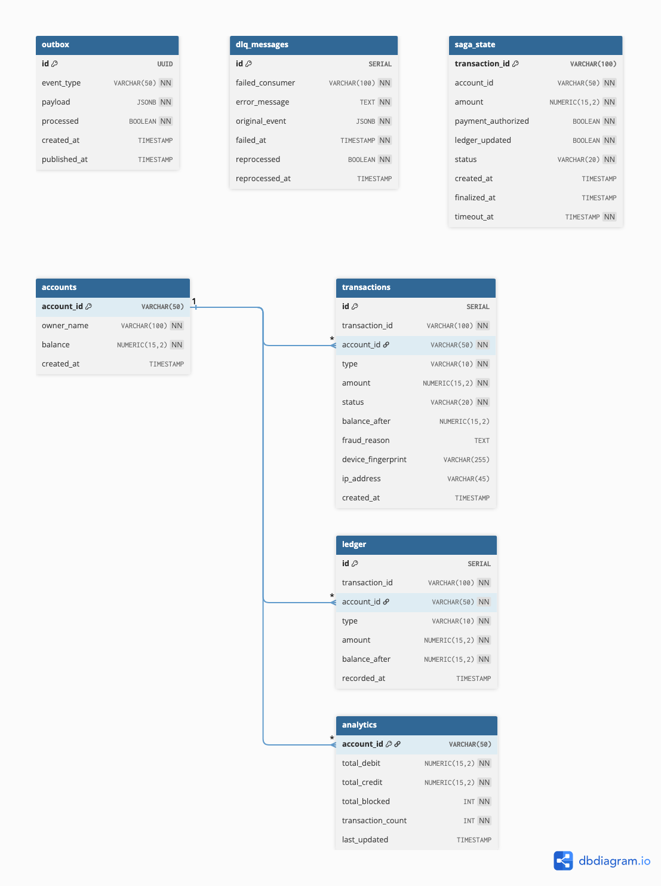

# 🏦 Real-Time Banking Transaction Processing System

A production-ready, event-driven banking system built with **Node.js**, **TypeScript**, **PostgreSQL**, and **Apache Kafka**.

Handles real-world banking concerns — atomic balance updates, fraud detection, event-driven side effects, distributed saga orchestration, and full audit replay.

---

## 📐 Architecture

```
CLIENT
  │
  ├── POST /transactions        (submit transaction)
  ├── GET  /sse/:account_id     (real-time updates)
  ├── GET  /audit/...           (audit + replay)
  └── GET  /dlq                 (dead letter queue)
  │
  ▼
TRANSACTION SERVICE (sync core)
  ├── idempotency check
  ├── fraud detection (sync)
  ├── row-level lock (FOR UPDATE)
  ├── atomic balance update
  └── outbox event written
  │
  ▼
OUTBOX WORKER
  └── polls DB → publishes to Kafka
  │
  ▼
KAFKA
  ├── transactions.events
  ├── transactions.blocked
  ├── ledger.events
  ├── transactions.finalized
  └── transactions.dlq
  │
  ├── Notification Consumer  → simulated Email/SMS
  ├── Ledger Consumer        → append-only ledger
  ├── Analytics Consumer     → aggregated metrics
  └── Orchestrator           → saga + finalization
  │
  ▼
SSE SERVICE → real-time push to browser
```

---

## 🗄️ DB Schema



---

## ⚙️ Tech Stack

| Layer | Technology |
|---|---|
| Runtime | Node.js |
| Language | TypeScript |
| Framework | Express |
| Database | PostgreSQL (raw `pg`) |
| Message Broker | Apache Kafka (KafkaJS) |
| Real-time | Server-Sent Events (SSE) |
| Testing | Jest |

---

## 🚀 Getting Started

### Prerequisites
- Node.js 18+
- PostgreSQL 14+
- Apache Kafka 3+
- Java 11+ (required for Kafka)

### 1. Clone the repo
```bash
git clone https://github.com/YOUR_USERNAME/banking-system.git
cd banking-system
```

### 2. Install dependencies
```bash
npm install
```

### 3. Set up environment
```bash
cp .env.example .env
# edit .env with your DB credentials
```

### 4. Set up database
```bash
psql -U postgres -c "CREATE DATABASE banking_db;"
psql -U postgres -d banking_db -f schema.sql
```

### 5. Start Kafka
```bash
# in kafka directory
bin/zookeeper-server-start.sh config/zookeeper.properties
bin/kafka-server-start.sh config/server.properties    # new terminal
```

### 6. Start the server
```bash
npm run dev
```

---

## 📡 API Endpoints

### Transactions
```
POST /transactions          submit a transaction
GET  /sse/:account_id       subscribe to real-time updates
```

### Audit & Replay
```
GET  /audit/account/:id             full event history
GET  /audit/account/:id/replay      rebuild balance from events
GET  /audit/transaction/:id         full trace of one transaction
```

### Dead Letter Queue
```
GET  /dlq                           list failed messages
POST /dlq/reprocess/:id             manually reprocess a failed message
```

### Health
```
GET  /health                        DB connectivity check
```

---

## 🔁 Transaction Request

```json
POST /transactions
{
  "transaction_id":     "txn_001",
  "account_id":         "acc_123",
  "type":               "DEBIT",
  "amount":             10000,
  "device_fingerprint": "device-abc123",
  "ip_address":         "192.168.1.1"
}
```

### Responses

| Status | HTTP | Meaning |
|---|---|---|
| COMPLETED | 200 | Transaction successful |
| DUPLICATE | 409 | Already processed |
| BLOCKED | 402 | Fraud detected |
| ERROR | 422 | Insufficient balance / not found |

---

## 🛡️ Fraud Detection

### Sync (blocks before money moves)
| Rule | Threshold | Action |
|---|---|---|
| Amount limit | > ₹50,000 | Block immediately |
| Velocity | > 5 txns in 60s | Block immediately |

### Async (pattern analysis)
- Tracks `device_fingerprint` and `ip_address`
- Flags suspicious patterns after the fact
- Non-blocking — does not affect transaction flow

---

## 📨 Real-Time Updates (SSE)

```javascript
// browser
const es = new EventSource("http://localhost:3000/sse/acc_123");

es.onmessage = (e) => {
  const event = JSON.parse(e.data);
  console.log(event.type); // PENDING, COMPLETED, BLOCKED, FINALIZED, FAILED
};
```

### Event flow
```
PENDING    → immediately on request arrival
COMPLETED  → after balance updated in DB
BLOCKED    → when fraud detected
FINALIZED  → after orchestrator confirms all steps done
FAILED     → if saga times out (ledger never confirmed)
```

---

## 🔄 Reliability Guarantees

| Concern | Solution |
|---|---|
| Exactly-once balance update | DB transaction + idempotency key |
| At-least-once Kafka delivery | Outbox pattern + manual ack |
| Duplicate message safety | `ON CONFLICT DO NOTHING` in consumers |
| Retry on failure | Exponential backoff (2s → 4s → 8s) |
| Poison message | Caught → sent to DLQ → consumer moves on |
| Worker crash | Outbox row stays unprocessed → retried on next poll |
| Broker restart | KafkaJS auto-reconnects |

---

## 🔬 Simulations

### 1. Duplicate Transaction
```bash
# send same transaction_id twice
curl -X POST http://localhost:3000/transactions \
  -H "Content-Type: application/json" \
  -d '{"transaction_id":"txn_001","account_id":"acc_123","type":"DEBIT","amount":1000}'

# second call returns 409 DUPLICATE — balance unchanged
curl -X POST http://localhost:3000/transactions \
  -H "Content-Type: application/json" \
  -d '{"transaction_id":"txn_001","account_id":"acc_123","type":"DEBIT","amount":1000}'
```

**Expected:** First call debits ₹1,000. Second call returns cached result. Balance only changes once.

---

### 2. Concurrent Debit Requests
```bash
# fire two ₹60,000 debits at same time on ₹100,000 account
curl -X POST http://localhost:3000/transactions \
  -d '{"transaction_id":"txn_c1","account_id":"acc_123","type":"DEBIT","amount":60000}' &

curl -X POST http://localhost:3000/transactions \
  -d '{"transaction_id":"txn_c2","account_id":"acc_123","type":"DEBIT","amount":60000}' &

wait
```

**Expected:** One succeeds (balance → ₹40,000). Other fails with insufficient balance. Never goes negative.

---

### 3. Worker Crash During Processing
```bash
# submit transaction — outbox row created with processed=false
curl -X POST http://localhost:3000/transactions \
  -d '{"transaction_id":"txn_crash","account_id":"acc_123","type":"DEBIT","amount":1000}'

# stop the server (simulate crash)
# restart server — outbox worker picks up unprocessed row and retries
```

**Expected:** Event is never lost. Worker retries on next poll after restart.

---

### 4. Retry + DLQ Behavior
```bash
# stop kafka broker to simulate failure
# submit transaction — outbox worker will retry 3 times
# after 3 failures → message lands in DLQ

# check DLQ
curl http://localhost:3000/dlq

# restart kafka, reprocess
curl -X POST http://localhost:3000/dlq/reprocess/1
```

**Expected:** Retries with 2s → 4s → 8s delays. After 3 failures → DLQ. Reprocess succeeds after Kafka is back.

---

### 5. Fraud Block
```bash
# Rule 1: amount over ₹50,000
curl -X POST http://localhost:3000/transactions \
  -d '{"transaction_id":"txn_f1","account_id":"acc_123","type":"DEBIT","amount":75000}'
# → 402 BLOCKED

# Rule 2: more than 5 transactions in 60 seconds
for i in {1..6}; do
  curl -X POST http://localhost:3000/transactions \
    -d "{\"transaction_id\":\"txn_v$i\",\"account_id\":\"acc_123\",\"type\":\"DEBIT\",\"amount\":1000}"
done
# → first 5 succeed, 6th is BLOCKED
```

**Expected:** Balance never changes for blocked transactions.

---

### 6. Event Replay Rebuilding Balance
```bash
# check current balance
curl http://localhost:3000/audit/account/acc_123/replay
```

**Expected response:**
```json
{
  "replayed_balance": 95000,
  "actual_balance":   95000,
  "match": true,
  "steps": [
    { "type": "DEBIT",  "amount": 5000, "balance_before": 100000, "balance_after": 95000 }
  ]
}
```

Replayed balance must always match actual balance. If not → data integrity issue.

---

### 7. 🚨 Attacker Simulation (Hacked Account)

Scenario: username/password leaked. Attacker tries to empty the account by sending 20 rapid ₹10,000 payments.

```bash
# simulate attacker firing 20 rapid requests
for i in {1..20}; do
  curl -X POST http://localhost:3000/transactions \
    -H "Content-Type: application/json" \
    -d "{
      \"transaction_id\": \"txn_attack_$i\",
      \"account_id\": \"acc_123\",
      \"type\": \"DEBIT\",
      \"amount\": 10000,
      \"device_fingerprint\": \"attacker-device-abc123\",
      \"ip_address\": \"192.168.1.100\"
    }" &
done
wait
```

**Expected:**
- First 5 transactions go through (velocity limit)
- Remaining 15 are blocked
- Maximum loss: ₹50,000 (5 × ₹10,000)
- All blocked transactions share same `device_fingerprint` and `ip_address`
- Async fraud analysis flags this device for investigation

```bash
# check audit to see attacker pattern
curl http://localhost:3000/audit/account/acc_123
```

---

## 🧪 Running Tests

```bash
# create test database
psql -U postgres -c "CREATE DATABASE banking_db_test;"
psql -U postgres -d banking_db_test -f schema.sql

# run all tests
npm test
```

### Test coverage
| Test | What it proves |
|---|---|
| Duplicate transaction | Idempotency works |
| Concurrent debits | Row-level lock prevents double spend |
| Worker crash | Outbox guarantees no event loss |
| Retry + DLQ | Graceful failure handling |
| Fraud block | Money never moves for blocked transactions |
| Event replay | Balance can always be rebuilt from events |
| Attacker simulation | Velocity fraud catches rapid attacks |

---

## 📁 Project Structure

```
src/
├── app.ts                        entry point
├── db.ts                         PostgreSQL pool
├── kafka/
│   ├── producer.ts               Kafka producer singleton
│   ├── consumer.ts               base consumer factory
│   └── topics.ts                 topic name constants
├── routes/
│   ├── transactions.ts           POST /transactions
│   ├── sse.ts                    GET /sse/:account_id
│   ├── audit.ts                  audit + replay endpoints
│   └── dlq.ts                    DLQ endpoints
├── services/
│   ├── transactionService.ts     core transaction logic
│   ├── sseService.ts             SSE connection manager
│   └── sagaStore.ts              saga state DB operations
├── consumers/
│   ├── notificationConsumer.ts   email/SMS simulation
│   ├── ledgerConsumer.ts         append-only ledger
│   ├── analyticsConsumer.ts      metrics aggregation
│   ├── orchestratorConsumer.ts   saga orchestration
│   └── dlqConsumer.ts            dead letter queue
├── workers/
│   └── outboxWorker.ts           polls outbox → publishes to Kafka
└── utils/
    └── retry.ts                  exponential backoff + DLQ
```

---

## 📊 Key Design Decisions

**Why raw `pg` over Prisma/Sequelize?**
The core of this system is `SELECT FOR UPDATE` and atomic transactions. ORMs abstract this away — raw SQL gives full control over locking and atomicity.

**Why Outbox pattern over direct Kafka publish?**
Publishing directly to Kafka after a DB commit can fail silently. The outbox writes the event to DB in the same transaction — guaranteed to exist even if Kafka is down.

**Why SSE over WebSocket?**
Server pushes events to client — purely unidirectional. SSE is simpler, built into browsers natively, and perfectly fits the use case.

**Why partition Kafka by account_id?**
Guarantees event ordering per account. All events for `acc_123` go to the same partition — critical for balance reconstruction and saga correlation.